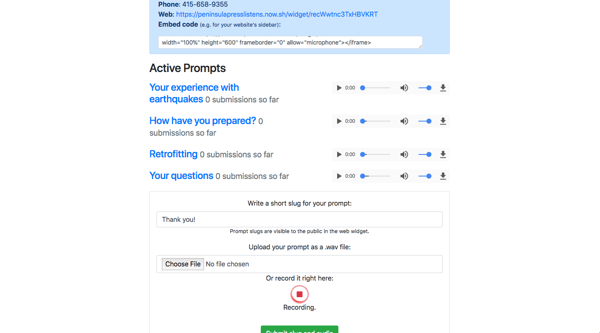

# Call Collect

*Enabling any journalist to gather audio from the public*

By [Alec Glassford](mailto:glassford@cs.stanford.edu)
Advisor: Dan Nguyen
16 March 2018

## Abstract

Call Collect is an open source web application for gathering audio. It helps journalists quickly create call-in numbers and simple web widgets where people can record themselves. It's designed so that any newsroom can set up its own copy of the software easily and affordably.

## Background

### Audience participation in journalism

Journalists act as conduits between the worlds of their stories and the audiences of those stories. Done well, this can produce compelling work: stories that entertain or captivate, or inform people about important issues.

Embracing overlap between the world of a story and its audience can add further richness. On one hand, your readers or listeners can act as a legion of eager sources with experiences, perspectives, and expertise that broaden the information base of your work. On the other, engaging the public as you create a story helps align your reporting with people's information needs and wants, producing work that they will care about.

These ideas are not particularly novel, but today's technology lets us carry them out with relative ease, effectiveness, and scale. Comments sections and social media let journalists communicate with their audience broadly and directly, with varying effectiveness. But recently, more structured and purposeful efforts to "crowdsource" on the Web have emerged.

For example, in 2015, *ProPublica* and *The Virginian-Pilot* [gathered thousands of stories about Agent Orange exposure](https://www.propublica.org/getinvolved/5-things-we-learned-collecting-3352-stories-about-agent-orange-exposure) by sharing a survey with veteran-focused Facebook groups and other online communities. [Hearken](https://www.wearehearken.com/) has developed software and consulting services that help journalists involve the public in various parts of the reporting process; [The Coral Project's free Ask tool](https://coralproject.net/products/ask.html), like Hearken, creates forms journalists can use to engage the public; and [GroundSource](https://www.groundsource.co/) helps them communicate at scale over SMS.

These practices may be more useful for some reporting projects than others. But even for reporting that uses documents, government officials, or other subject-specific actors as core sources, the experience of the general public is likely relevant to the story. Otherwise, why are you telling it?

In a time when information of diverse quality abounds online and the public's valuation of media is uncertain and varying, journalists who take seriously their role as attentive agents of their audiences can earn a special kind of trust and legitimacy.

### Audio and audience

Radio, in particular, has venerable traditions of involving its audience and the general public in its storytelling: consider call-in shows and *vox populi* ("voice of the people," sometimes called "man-on-the-street") interviews. Radio's inherently local nature and its ability to literally bring you a stranger's voice make it especially suited to including community members.

While podcasting has shed the first characteristic, it keeps the second, and a number of podcasts have experimented with asynchronous methods of gathering and presenting swaths of voices from their audiences. For example, *Death, Sex & Money* used listener audio submissions as the basis for [its series on student loans](https://project.wnyc.org/death-sex-money-podcast-student-loans/). That show is one of many where you can hear regular pleas for listeners to record voice memos on their phones and email them to the podcast producers.

Other podcasts, like [*Every Little Thing*](https://www.gimletmedia.com/every-little-thing) and [*California Speaks*](https://speakca.net/), center themselves on listener engagement with a single a resource—in these cases, a voicemail hotline. A number of other podcasts, like [*Curious City*](https://curiouscity.wbez.org/) and [*Bay Curious*](https://www.kqed.org/news/series/baycurious), use Hearken to gather and select story pitches—in text, not as audio.

Call Collect addresses shortcomings of these sometimes-convoluted workflows and provides journalists with a convenient way to gather audio from the public and bring a community's voices into its stories.

## Process

### Motivation and design

In the early months of 2017, I participated in Stanford's inaugural "Exploring Computational Journalism" seminar, where I worked with a team to consider how computation affects "audience participation and diverse viewpoints" in journalism. I began to understand the crucial role journalists could play, as agents of the people, to mediate public discourse.

A few months later, at the [Come and Play](http://comeandplay.org/) audio hackathon, I worked with a small group of radio producers and engineers to make the first prototype of Call Collect. While many projects at the hackathon focused on the experience of listening to podcasts, we developed Call Collect by thinking about how technology could help podcast producers do their work better.

We ended up with a relatively unsophisticated piece of software that let users create call-in phone numbers with one click. Callers would be prompted with custom prerecorded messages to guide them through a sort of automated interview. A podcast producer could then review the recorded phone calls.

Some people mentioned that we could adapt this software to run on smart speakers. While this was an interesting avenue for future work, our initial project emphasized reaching the most people possible: Smart speakers may get a lot of hype, but almost everyone has a phone.

After several podcast producers expressed interest in our prototype, I began thinking about how to expand the prototype into a useful product. Several high-level criteria came to mind:

* It should be easy and cheap for any newsroom to set up its own copy of the software, so that even small organizations can experiment with this type of audience engagement. (And so that they can to do it indefinitely, even if I don't have the resources to maintain a central server.)
* It should be able to collect calls over the phone and through a web/mobile interface, in order to provide a convenient alternative to the "record a voice memo, then email it" workflow.
* It should transcribe the calls it receives, enabling podcast producers to review the collected audio.

While the latter two criteria were implementation details, the first required a certain amount of careful design before coding began. It was inspired by other open source software designed to be run on a per-newsroom basis: The Marshall Project's [Klaxon](https://github.com/themarshallproject/klaxon) and The Coral Project's [Talk](https://coralproject.net/products/talk.html) and [Ask](https://coralproject.net/products/ask.html). Klaxon, in particular, can be set up on its own web server in just a few clicks, making it accessible even to teams without computer expertise.

At the start of 2018, I began building the current version of Call Collect. I won't go into the technical details of the project here, but I will note that it relies on several web services that are affordable and relatively simple to set up: Airtable for easy-to-use data storage, Twilio for handling phone calls, Google Cloud Platform for automated transcription, and Zeit Now for server hosting.

I think it's important to note just how much technology already exists that could make reporting and storytelling easier and better, but simply isn't designed with journalists in mind as its users. Designing tools to synthesize these technologies and make them accessible to journalists provides relatively low-hanging fruit that can be just as useful as working at the cutting edge of research.

### Prototyping

While developing Call Collect, I shared a prototype with the team behind [California Speaks](https://speakca.net/). They currently use a Google Voice phone number to gather listener responses to a weekly question, and it was very helpful to understand their use case and priorities.

Several parts of Call Collect were not particularly applicable to them. For example, since they operate an ongoing call-in line, they didn't need to create lots of new phone numbers. I realized that this would be a common use case, so I added a feature to let users transfer a single phone number between different projects. This enables team like theirs organize each week's question into a new project, while maintaining the consistency of a single hotline.

The California Speaks team's biggest desire was for more accurate automated transcription. Since Call Collect relies on Google Cloud Platform for transcription, and since digging into the technical process of transcription was outside the scope of my work, I knew that I couldn't make this part of Call Collect better than what Google Voice already offers.

However, I figured out one indirect way to make some improvement. The California Speaks team affirmed my observation that asking listeners to leave a voicemail on a hotline can reach more people than using a more complicated workflow with voice memos and email. On the other hand, audio recorded directly onto a smartphone or computer and sent over Web is generally of much higher quality than audio from phone calls. (This is the case whether you use Google Voice or Twilio.) Therefore it can be automatically transcribed more accurately.

After this meeting, I gave special attention to making a straightforward web interface for gathering recordings. Call Collect's web widget hopefully achieves this, and it works in smartphone web browsers as well as on computers. It doesn't fully solve issues with automated transcription, but it helps a little and provides an additional way to reach people.

## Walkthrough

### Set up

An interactive setup guide at https://alecglassford.github.io/call-collect walks users through creating accounts for all the requisite web services and deploys a new Call Collect web server directly from the page. None of the user's private information (e.g. API keys) ever leaves their web browser, except in a set of HTTPS requests to Zeit Now, where the new server will be hosted.

It's intended to get users with *no special technical knowledge* started with Call Collect in around half an hour.

### Interface for journalists

Call Collect lives behind a passphrase shared across a team. (It does not require individual accounts.) Its data model is organized around "projects," each with its own phone number and web widget. You can share these (e.g. on social media, read out loud in your podcast, in the episode's liner notes) to collect calls from your audience.

Journalists add "prompts" to each project, which structure calls into a multipart automated interview. The interface guides users through either uploading pre-recorded audio files or recording prompts directly in the browser.

As Call Collect receives submissions, it organizes them by prompt and caller (or in the case of web submissions, self-reported contact info and IP address) and automatically transcribes them. Journalists can then peruse, listen, and download the gathered audio.

### Interface for callers

People can share their voices with Call Collect by calling in or by using a web widget. Those who call by phone will hear prompts in sequence, with opportunities to record their responses after each.

Those recording via web widget read a short description of the project written by the journalist, then record their responses to each prompt directly in the web browser (mobile or desktop).

## Reflection and Future Work

I plan to continue work on Call Collect, in order to make it as useful and accessible to as many people as possible. While it has been designed with radio and podcast producers in mind, structured audience engagement and crowdsourcing can benefit journalists working in any medium—and perhaps many non-journalists too.

Future features may include the ability to collect non-audio content via SMS, email, or further web widgets. I have no interest in simply replicating existing software that already provides these functionalities—from GroundSource to MailChimp to Hearken to Google Forms— but perhaps future work can integrate with these tools, or else provide a simple alternative to some of the more full-fledged audience engagement services for newsrooms with limited resources.

By far the most crucial part of the development process was receiving feedback from the California Speaks team. I regret not doing more iterative user testing, and while this write-up marks a version 1 release, I look forward to prototyping Call Collect with more journalists in the near future. I encourage anyone interested to get in touch. I hope that this project can, in a small way, help make journalism more attentive to those it serves.

## Acknowledgments

First, thanks to Dan Nguyen, who has been a generous advisor on this project. Thanks also to Leah Culver, Brandon Grugle, Claire Mullen, and Sonia Paul for creating the first version of Call Collect with me, and Lam Thuy Vo for her continual encouragement of this work. Thanks to Angela Johnston and the others on the [California Speaks](https://speakca.net) team who shared their feedback. And to all those who have inspired me to think about how technology can help journalism serve its audience, including Alina Fichter, Louis Lafair, Ash Ngu, Cathy Deng, and Jay Hamilton.
